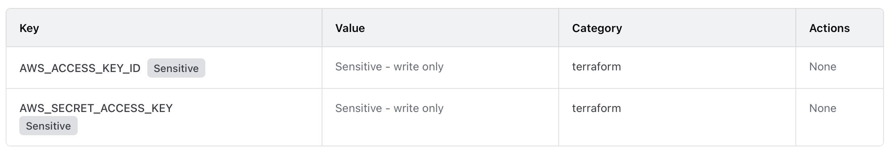
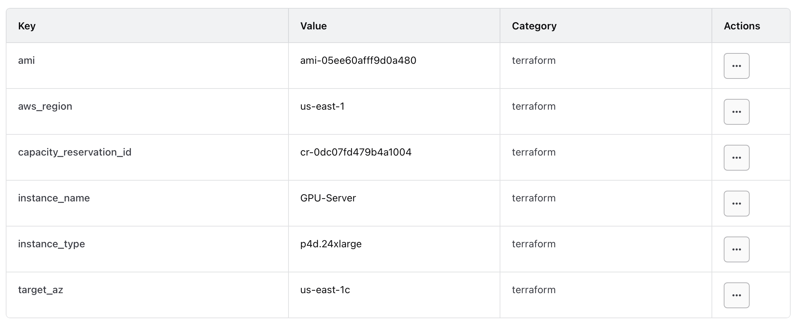

# AWS and HCP Configurations

## GPU Server

Set the correct organization and workspace in the environment variable

```bash
cloud {
    # Name of your Terraform Cloud organization
    organization = " "

    # Specify the workspace to use in Terraform Cloud
    workspaces {
      name = " "
    }
}
```

in the file `main.tf`. 

These are the HCP variables associated with this configuration.





Once the variables are set you can run

```bash
terraform init
```